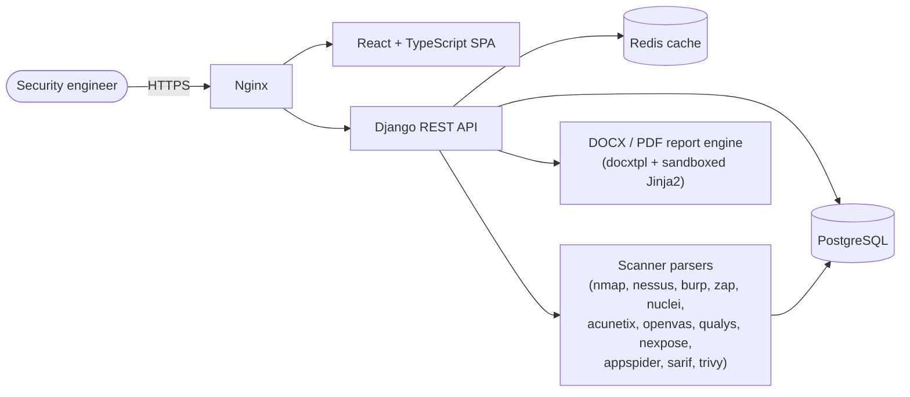

[](https://github.com/Gastordia/SecurityHub-Community/actions/workflows/ci.yml)
[](LICENSE.md)
[](https://www.docker.com/)
[](pyproject.toml)
[](frontend)

# SecurityHub Community Edition

Self-hosted vulnerability management and reporting platform for security teams.

---

## What it does

SecurityHub gives security teams a single place to import scanner findings, track them through remediation, and generate client-ready reports — on infrastructure they control.

## Contents

- [Features](#features)
- [Architecture at a glance](#architecture-at-a-glance)
- [Quick start](#quick-start)
- [Uninstalling](#uninstalling)
- [Development setup](#development-setup)
- [Documentation](#documentation)
- [Security](#security)
- [Contributing](#contributing)
- [License](#license)

---

## Features

**Vulnerability tracking**
- Manage findings across multiple projects with full status tracking and retest cycles
- Triage findings as false positive, suppressed, or verified; document risk acceptance decisions
- Capture SAST source/sink data, container and Kubernetes metadata, dependency information, compliance mappings, and MITRE ATT&CK details alongside each finding

**Scanner import — 12 parsers included**

Nessus · Burp Suite · Nmap · Acunetix · OWASP ZAP · Nuclei · OpenVAS · Qualys · Nexpose · AppSpider · SARIF · Trivy

Missing your scanner? Parsers are self-contained and designed to be community-contributed — see [Writing a parser](docs/writing-a-parser.md).

**Reporting**
- Generate PDF and DOCX reports from fully customizable templates
- Version-control templates and restore previous versions
- Inject charts, screenshots, and structured finding data dynamically

**Project management**
- Track scope, schedule, and status per project
- Import scope directly from Nmap XML output

**Reference data**
- Built-in vulnerability template library to speed up manual finding entry
- CWE reference data, project types, and report standards — all configurable

---

## Architecture at a glance



- **Backend:** Django + Django REST Framework, JWT auth, PostgreSQL (falls back to SQLite for local dev), Redis for shared caching.
- **Frontend:** React + TypeScript, built with Vite, served by Nginx alongside the API in production.
- **Parsers:** one self-contained package per scanner under `securityhub/utils/parsers/`, registered through a shared `BaseParser` interface — see [`docs/writing-a-parser.md`](docs/writing-a-parser.md).
- **Reports:** customizable DOCX/PDF templates rendered through a sandboxed template engine (see [SECURITY.md](SECURITY.md) for the SSTI hardening this requires).
- **Deployment:** Docker Compose (`nginx` + `securityhub` + `postgres`), fronted by `install.sh` for interactive first-time setup.

For a deeper walkthrough of the Django apps, data flow, and request lifecycle, see [`docs/ARCHITECTURE.md`](docs/ARCHITECTURE.md).

---

## Quick start

Requires Docker and Docker Compose.

```bash
git clone https://github.com/Gastordia/SecurityHub-Community.git
cd SecurityHub-Community
bash install.sh
```

The installer detects your operating system, installs Docker if needed, and walks through configuration interactively.

**Manual setup:**

```bash
cp env.example .env      # copy the config template
nano .env                # set SECRET_KEY, domain, and credentials
docker compose up -d
```

Once running, the application is available at:

| | URL |
|---|---|
| HTTP | http://localhost:3000 |
| HTTPS | https://localhost:8443 |
| API docs | https://localhost:8443/api/docs |

For production, point your domain's DNS at the host and set `ALLOWED_HOST`, `CORS_ALLOWED_ORIGINS`, and `CSRF_TRUSTED_ORIGINS` in `.env`. See [docs/INSTALLATION.md](docs/INSTALLATION.md) for the full guide.

---

## Uninstalling

Removes only what the installer created — source code, Docker, Node.js, and system packages are never touched.

```bash
bash uninstall.sh
```

**Options:**

| Flag | Effect |
|------|--------|
| `--keep-data` | Preserve the database (Docker volume or PostgreSQL DB) |
| `--keep-env` | Leave the `.env` file in place |
| `--yes` | Skip the confirmation prompt |

Uploaded files in `securityhub/media/` are always left intact regardless of flags.

---

## Development setup

**Backend:**

```bash
poetry install && poetry shell
python securityhub/manage.py migrate
python securityhub/manage.py first_setup
python securityhub/manage.py runserver
```

**Frontend:**

```bash
cd frontend
npm install
npm start        # dev server on :5173
```

**Tests:**

```bash
cd securityhub && pytest     # backend (must run from securityhub/, where manage.py lives)
cd frontend && npm test      # frontend
```

---

## Documentation

| Doc | What's in it |
|---|---|
| [docs/INSTALLATION.md](docs/INSTALLATION.md) | Pointers for Docker and local development install |
| [docs/ARCHITECTURE.md](docs/ARCHITECTURE.md) | Django apps, data flow, request lifecycle, parser pipeline |
| [docs/writing-a-parser.md](docs/writing-a-parser.md) | How to add support for a new scanner |
| API reference | Live OpenAPI docs at `/api/docs` on your running instance, or [`openapi-schema.yaml`](openapi-schema.yaml) |
| [CONTRIBUTING.md](CONTRIBUTING.md) | Dev environment setup, branching, commit style, PR process |
| [SECURITY.md](SECURITY.md) | Vulnerability disclosure policy, secure-coding rules (e.g. XML parsing) |
| [CODE_OF_CONDUCT.md](CODE_OF_CONDUCT.md) | Community expectations |

---

## Security

Report vulnerabilities privately via [GitHub Security Advisories](../../security/advisories/new). Do not open a public issue. See [SECURITY.md](SECURITY.md) for the full policy.

---

## Contributing

See [CONTRIBUTING.md](CONTRIBUTING.md).

## License

MIT — see [LICENSE.md](LICENSE.md).
