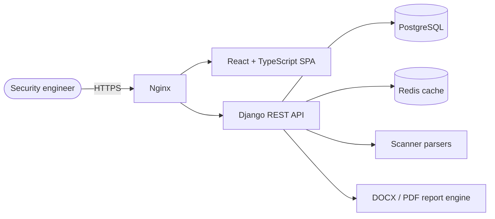

[](https://github.com/Gastordia/SecurityHub-Community/actions/workflows/ci.yml)
[](LICENSE.md)
[](https://www.docker.com/)
[](pyproject.toml)
[](frontend)

# SecurityHub Community Edition

SecurityHub is what you reach for when your team's vulnerability tracking is a shared spreadsheet, a folder of scanner exports, and a Word template someone hand-edits before every client deliverable. It's a self-hosted Django + React app that pulls scanner output into one place, carries findings through triage and retest, and renders the final report — on a server you control, not someone else's SaaS.

It's a community project, maintained by a small crew and open to contributions. Treat it accordingly: read the code before you trust it in production, and expect some rough edges alongside the parts that work well.

## Is this for you?

It's a good fit if you're a pentest team, an internal AppSec group, or a consultant who wants:
- one place to land findings from several scanners instead of re-keying them by hand
- reports you can template and regenerate instead of rebuilding from scratch each time
- to keep client data on infrastructure you run, not a third party's

It's probably the wrong tool if you want a hosted SaaS, a one-command single binary, or a mature scanner-orchestration platform that deploys agents for you — SecurityHub doesn't run scans, it organizes what your scanners already produced.

## What it actually does

- Tracks vulnerabilities per project, with status history and retest cycles — not just a flat findings table.
- Parses output from 12 scanners: `Nessus`, `Burp Suite`, `Nmap`, `Acunetix`, `OWASP ZAP`, `Nuclei`, `OpenVAS`, `Qualys`, `Nexpose`, `AppSpider`, `SARIF`, and `Trivy`. Missing yours? Parsers are meant to be community-contributed — see [docs/writing-a-parser.md](docs/writing-a-parser.md).
- Generates PDF and DOCX reports from templates you can customize, plus imports project scope straight from Nmap XML.
- Ships reference data out of the box — CWE lookups, project types, report standards — so you're not starting from a blank form.
- Exposes an OpenAPI schema (via `drf-spectacular`) if you want to script against it.

## How it's put together



Django + DRF on the backend, React + TypeScript (Vite) on the frontend, PostgreSQL for real deployments (SQLite is a local-dev fallback only), and an optional Redis cache if you're running more than one worker. Docker Compose ties `nginx`, `securityhub`, and `postgres` together. For the parts this diagram doesn't cover — request flow, the parser pipeline, where the sharp edges are — see [docs/ARCHITECTURE.md](docs/ARCHITECTURE.md).

## Getting it running

The path of least resistance is Docker. You'll need Docker and Docker Compose installed, then:

```bash
git clone https://github.com/Gastordia/SecurityHub-Community.git
cd SecurityHub-Community
bash install.sh
```

`install.sh` detects your OS, installs Docker if it's missing, writes a `.env` for you interactively (ports, secrets, database credentials, the admin account you'll log in with), and brings the stack up. If you'd rather do that by hand:

```bash
git clone https://github.com/Gastordia/SecurityHub-Community.git
cd SecurityHub-Community
cp env.example .env
```

Open `.env` and set at least: `SECRET_KEY`, `ALLOWED_HOST`, `CORS_ALLOWED_ORIGINS`, `CSRF_TRUSTED_ORIGINS`, `POSTGRES_PASSWORD`, `REDIS_PASSWORD`, `FRONTEND_URL`, `SETUP_EMAIL`, and `SETUP_PASSWORD` (or leave the placeholder and change it the moment you log in — don't leave it). Then:

```bash
docker compose up -d
```

With the default port mapping, you'll find the frontend at `http://localhost:3000` (redirects to `https://localhost:8443`), and the API docs at `https://localhost:8443/api/docs/` — that page needs you to be logged in, so if it 401s, that's expected. There's also a checked-in schema snapshot at [openapi-schema.yaml](openapi-schema.yaml) and a live schema endpoint at `/api/schema/`. PostgreSQL is a hard requirement once you're past local dev.

### First login

The initial admin account comes from `manage.py first_setup`, which `install.sh` runs for you — and which the container also runs automatically on first boot if it detects a fresh instance. The account details come from `.env`: `SETUP_USERNAME`, `SETUP_EMAIL`, `SETUP_FULL_NAME`, `SETUP_POSITION`, `SETUP_COMPANY_NAME`, `SETUP_PASSWORD`. If you never set `SETUP_PASSWORD` and it's still the documented placeholder (`ChangeMe123!`), change it right after your first login — it's a known default, not a secret.

### Before you put this in front of anyone else

Local defaults are intentionally loose so the quick start works without a fight. Production is not the same checklist:

- a real `SECRET_KEY`, real hostnames in `ALLOWED_HOST`, exact origins (not wildcards) in `CORS_ALLOWED_ORIGINS` and `CSRF_TRUSTED_ORIGINS`
- `DEBUG=False`, PostgreSQL (not SQLite), HTTPS in front of the app
- `WHITELIST_IP` reviewed carefully — it's the allowlist that governs what the backend is permitted to fetch when a report pulls in remote content, so it's a real security boundary, not a formality

Storage defaults to the local filesystem; set `USE_S3=True` plus the `AWS_*` variables in [env.example](env.example) if you want S3-compatible storage instead. Caching defaults to per-process memory when `REDIS_URL` is blank — fine for one worker, not for several, so set it if you're running multiple Gunicorn workers or replicas.

## Working on it locally

Python dependencies are managed with `uv` — `pyproject.toml` and `uv.lock` are the source of truth, not `requirements.txt` (there isn't one anymore).

```bash
cp env.example .env
uv sync
uv run python securityhub/manage.py migrate
uv run python securityhub/manage.py first_setup
uv run python securityhub/manage.py runserver
```

Drop all the `POSTGRES_*` variables from `.env` and Django falls back to SQLite automatically — fine for poking around locally. Redis is likewise optional for a single-worker dev setup.

Frontend:

```bash
cd frontend
npm install
npm start   # Vite dev server on http://localhost:5173
```

Tests — note that `pytest` needs to run from `securityhub/`, not the repo root (it's where `manage.py` lives and pytest-django needs to find it):

```bash
uv run python securityhub/manage.py test
cd securityhub && uv run pytest
```

Frontend tests: `cd frontend && npm test`.

## Where things live

- `securityhub/` — the Django project and its apps
- `securityhub/utils/parsers/` — one self-contained package per scanner
- `securityhub/tests/fixtures/scans/` — sample scan files the parser test suite runs against
- `frontend/` — the React app
- `docker/` — Dockerfiles for the API and frontend images
- `scripts/` — startup scripts, nginx config templates
- `docs/` — everything below

| Doc | What it covers |
|---|---|
| [docs/INSTALLATION.md](docs/INSTALLATION.md) | Pointers for Docker and local-dev install |
| [docs/ARCHITECTURE.md](docs/ARCHITECTURE.md) | Django apps, request flow, the parser pipeline, where the known rough edges are |
| [docs/writing-a-parser.md](docs/writing-a-parser.md) | The contract a new scanner parser needs to follow |
| [CONTRIBUTING.md](CONTRIBUTING.md) | Dev environment setup, branching, commit style, how to submit a PR |
| [SECURITY.md](SECURITY.md) | Disclosure policy and the secure-coding rules we actually enforce (e.g. no raw XML parsing) |
| [CODE_OF_CONDUCT.md](CODE_OF_CONDUCT.md) | What we expect from each other here |

## Taking it back out

`uninstall.sh` removes what the installer put there. Your source tree and anything outside what `install.sh` touched are left alone.

```bash
bash uninstall.sh
```

`--keep-data` preserves the database, `--keep-env` leaves `.env` in place, `--yes` skips the confirmation prompt. Whatever you've got in `securityhub/media/` (uploaded files, PoC screenshots) survives regardless of which flags you pass.

## Security

Found a vulnerability? Report it privately through [GitHub Security Advisories](../../security/advisories/new) — not a public issue. See [SECURITY.md](SECURITY.md) for the full policy, including the areas we consider highest-risk (report rendering, file upload, XML parsing) and why.

On our own side: every push runs CodeQL alongside Trivy, Semgrep, Bandit, Gitleaks, Hadolint, and Checkov, plus an OWASP ZAP baseline scan against the running stack; Dependabot watches dependencies continuously in the background. None of that makes the app bulletproof — it means known classes of bugs get caught before they sit in `main` for long, and we'd rather you knew that than assumed it.

## Contributing

New parsers, bug fixes with a test attached, documentation corrections, and report-template improvements are all genuinely useful contributions — this isn't a "good first issue only" courtesy line. Start with [CONTRIBUTING.md](CONTRIBUTING.md).

## License

MIT — see [LICENSE.md](LICENSE.md).
