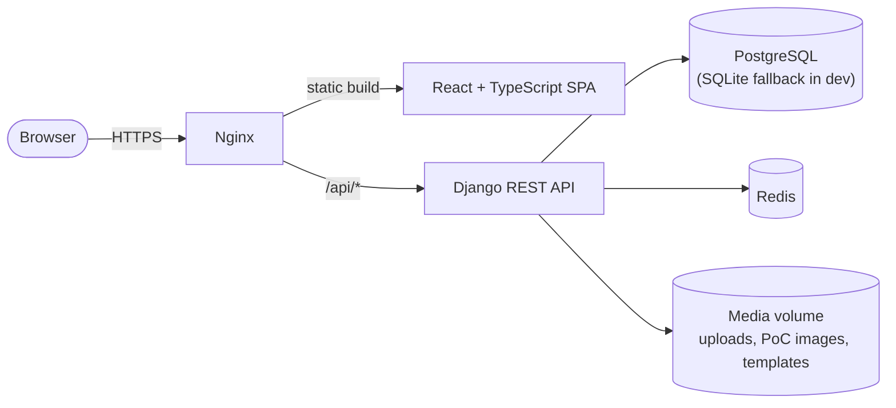

# Architecture

This is a tour of how SecurityHub is put together — for the "how do I add a
scanner" question, see [`writing-a-parser.md`](writing-a-parser.md) instead.

## Components

- **`nginx`** serves the built frontend and reverse-proxies `/api/*` to the Django
  container. It's the only service with a published port in the default Docker
  Compose setup.
- **`securityhub`** is the Django + DRF API. Runs migrations and health checks on
  startup (`docker/Dockerfile_API`, `scripts/backend.sh`).
- **`postgres`** is the primary datastore. Local development without
  `POSTGRES_*` env vars falls back to SQLite (see `securityhub/settings.py`).
- **Redis** is an optional shared cache backend for multi-worker deployments —
  not required for a single-worker local setup.

## Django apps

| App | Responsibility |
|---|---|
| `accounts` | Custom user model, JWT auth (`rest_framework_simplejwt`), auth tokens |
| `project` | Core domain: `Project`, `Vulnerability`, `VulnerableInstance`, `ProjectScope`, `Retest`, `SLAPolicy`, `FindingComment` — and the scanner upload endpoint |
| `vulnerability` | `VulnerabilityDB` — the reusable vulnerability template library, synced from a configurable GitHub source |
| `configapi` | `ProjectType`, `ReportStandard`, `ReportTemplate` + `TemplateVersion` (versioned DOCX/PDF report templates) |
| `dashboard` | Aggregated cross-project statistics (`DashboardSnapshot`) |
| `webhooks` | `WebhookConfig` / `WebhookDelivery` — outbound event notifications |
| `assets` | `Asset` inventory, populated by the parser pipeline's asset-profiling step |
| `utils` | Shared, cross-app code: the parser framework (`utils/parsers/`), the parser service (`utils/services/parser_service.py`), secure XML parsing (`utils/xml.py`), audit logging, input validation, throttling |

Each app follows Django convention: `models.py`, `views/` (split by resource
where the app is large, e.g. `project/views/`), `serializers.py`, `urls.py`.

## Request lifecycle: uploading a scan report

1. `POST /api/project/projects/<id>/parser/upload/` (`project/views/parser.py`)
   receives the multipart file.
2. `ParserService.parse_file()` (`utils/services/parser_service.py`) writes it
   to a temp path and calls `auto_detect_scanner_type()`, which tries every
   registered parser's `validate_file()` in registration order and uses the
   first match — **not** `utils/services/scanner_detector.py`, which exists
   but isn't wired into this path (see note below).
3. The matched parser's `parse_findings()` returns a list of
   `StandardizedFinding` (`utils/parsers/models.py`) — the common shape every
   scanner format gets normalized into.
4. `upload_project_parser_file` deduplicates against existing `Vulnerability`
   rows (by project + title), creating a new `Vulnerability` or appending a
   `VulnerableInstance` to an existing one.
5. The frontend lists/filters findings via `project/views/vulnerability_crud.py`
   and renders `vulnerabilitydescription`/`POC` as **plain text** — there is no
   Markdown or HTML renderer anywhere in the app (frontend or the DOCX/PDF
   exporter), which is why parsers must emit plain text (see
   `writing-a-parser.md`).

> **Known inconsistency:** `utils/services/scanner_detector.py` implements an
> alternative, extension-priority-based detection strategy but is only
> exercised by its own test — the real upload path always goes through
> `ParserService.auto_detect_scanner_type()`. If you're touching detection
> logic, that's the file that matters; treat `scanner_detector.py` as legacy
> until one is deleted or the other is wired in.

## Reporting

`configapi.ReportTemplate`/`TemplateVersion` store versioned DOCX templates.
`project/report.py` renders them with `docxtpl` (Jinja2 templating) and
optionally converts to PDF. Because the template content is user-editable,
report rendering runs through a **sandboxed** Jinja2 environment — this is a
deliberate SSTI mitigation documented in [`SECURITY.md`](../SECURITY.md); don't
bypass it when touching report generation.

## Auth & multi-tenancy

Auth is JWT-based (`accounts.views.MyTokenObtainPairView`), with access/refresh
tokens and an `AUTH_COOKIE_SECURE` setting that adapts to `DEBUG`. Most
resource views are tenant-scoped via `utils/views.get_scoped_project()` —
prefer that helper over querying `Project`/`Vulnerability` directly in new
views, since it's where cross-tenant access checks live.

## Frontend

`frontend/` is a Vite + React + TypeScript SPA. Top-level pages live in
`frontend/src/pages/` (`Dashboard`, `Projects`, `Workspace` — the per-project
findings view, `VulnDB`, `Settings`, `Profile`, `Login`). State/data-fetching
conventions live under `frontend/src/stores/` and `frontend/src/lib/`.

## Where to go next

- Adding a scanner parser → [`writing-a-parser.md`](writing-a-parser.md)
- Setting up a dev environment → [`CONTRIBUTING.md`](../CONTRIBUTING.md)
- Security-sensitive areas (XML parsing, SSTI, path traversal, file upload) →
  [`SECURITY.md`](../SECURITY.md)
